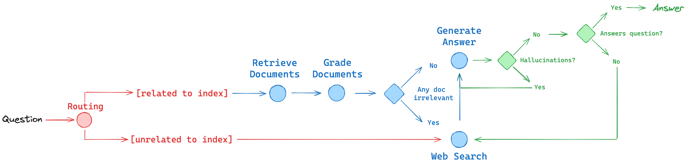
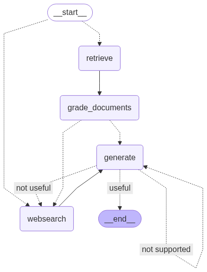

# Agentic RAG

This project implements an advanced Retrieval-Augmented Generation (RAG) system using LangGraph that goes beyond traditional RAG by incorporating intelligent routing, document quality assessment, hallucination detection, and dynamic web search capabilities.




[Read more about Reflection Agents](https://blog.langchain.com/reflection-agents/)

## Table of Contents

- [Overview](#overview)
- [Features](#features)
- [Architecture](#architecture)
- [Getting Started](#getting-started)
- [Usage](#usage)
- [Project Structure](#project-structure)
- [Workflow](#workflow)
- [Configuration](#configuration)
- [When to Use This Project](#when-to-use-this-project)
- [Pros and Cons](#pros-and-cons)
- [Future Improvements](#future-improvements)

## Overview

Agentic RAG is a sophisticated Python-based system that enhances traditional RAG with agentic capabilities. It intelligently routes queries to appropriate data sources, evaluates document relevance, detects hallucinations, and dynamically incorporates web search when needed. This makes it ideal for applications requiring high-quality, grounded responses with minimal hallucination.

## Features

- **Intelligent Query Routing**: Automatically determines whether to use vector search or web search based on query analysis
- **Document Quality Assessment**: Grades retrieved documents for relevance to the query
- **Hallucination Detection**: Evaluates generated responses for factual grounding in source documents
- **Dynamic Web Search Integration**: Falls back to web search when vector store results are insufficient
- **Multi-Source Knowledge**: Combines vector store knowledge with real-time web information
- **Quality Assurance**: Multiple grading stages ensure response quality and relevance

## Architecture

The system is built using LangGraph's StateGraph with the following key components:

### Core Nodes

- **Router**: Analyzes queries and routes to appropriate data source
- **Retrieve**: Fetches relevant documents from vector store
- **Grade Documents**: Evaluates document relevance to the query
- **Web Search**: Performs real-time web searches when needed
- **Generate**: Creates responses using retrieved information
- **Quality Graders**: Assess response quality and hallucination

### State Management

The system maintains state across nodes including:

- Question/query
- Retrieved documents
- Generated responses
- Quality scores
- Routing decisions

## Getting Started

### Prerequisites

- Python 3.12+
- Poetry for dependency management
- OpenAI API key
- Tavily API key (for web search)

### Installation

1. Clone the repository:

   ```bash
   git clone <repository-url>
   cd agentic-rag
   ```

2. Install dependencies using Poetry:

   ```bash
   poetry install
   ```

3. Set up environment variables:

   ```bash
   cp .env.example .env
   ```

   Add your API keys to `.env`:

   ```
   OPENAI_API_KEY=your_openai_api_key
   TAVILY_API_KEY=your_tavily_api_key
   ```

4. Run the ingestion script to populate the vector store:
   ```bash
   poetry run python ingestion.py
   ```

## Usage

### Basic Usage

Run the main application:

```bash
poetry run python main.py
```

### Example Query

```python
from graph.graph import app

# Example query
result = app.invoke({
    "question": "What are the latest developments in agent memory systems?"
})

print(result["generation"])
```

### Advanced Usage

The system automatically:

1. Routes your query to the most appropriate data source
2. Retrieves and grades relevant documents
3. Generates a response
4. Evaluates the response for hallucinations
5. Falls back to web search if needed
6. Re-generates if quality standards aren't met

## Project Structure

```
agentic-rag/
├── graph/
│   ├── nodes/           # Graph execution nodes
│   │   ├── retrieve.py
│   │   ├── grade_documents.py
│   │   ├── generate.py
│   │   └── web_search.py
│   ├── chains/          # LangChain processing chains
│   │   ├── router.py
│   │   ├── answer_grader.py
│   │   ├── hallucination_grader.py
│   │   └── retrieval_grader.py
│   ├── graph.py         # Main workflow definition
│   ├── state.py         # State schema
│   └── consts.py        # Constants
├── ingestion.py         # Vector store population
├── main.py             # Entry point
├── pyproject.toml      # Dependencies
└── README.md
```

## Workflow

1. **Query Routing**: The system analyzes the input question and determines whether to use vector search or web search
2. **Document Retrieval**: If routed to vector search, retrieves relevant documents from the Chroma vector store
3. **Document Grading**: Evaluates retrieved documents for relevance to the query
4. **Decision Making**: If documents are insufficient, routes to web search
5. **Response Generation**: Generates a response using available information
6. **Quality Assessment**: Evaluates the response for:
   - Hallucination detection (factual grounding)
   - Question relevance
7. **Iterative Improvement**: Re-generates or incorporates web search if quality standards aren't met

## Configuration

### Environment Variables

- `OPENAI_API_KEY`: Your OpenAI API key for LLM operations
- `TAVILY_API_KEY`: Your Tavily API key for web search functionality

### Vector Store

The system uses Chroma as the vector store with OpenAI embeddings. Documents are automatically chunked and indexed during ingestion.

### Customization

You can modify:

- Document chunking parameters in `ingestion.py`
- Grading thresholds in the chain configurations
- Routing logic in `graph/chains/router.py`
- Quality assessment criteria in the grader chains

## When to Use This Project

Use Agentic RAG when you need:

- **High-Quality Responses**: Systems requiring minimal hallucination and factual accuracy
- **Multi-Source Information**: Applications that benefit from both stored knowledge and real-time information
- **Quality Assurance**: Critical applications where response quality is paramount
- **Intelligent Routing**: Systems that need to automatically choose between different information sources
- **Research Applications**: Academic or research tools requiring comprehensive information gathering

## Pros and Cons

| Pros                              | Cons                                |
| --------------------------------- | ----------------------------------- |
| Intelligent query routing         | Higher computational overhead       |
| Multi-stage quality assessment    | Requires multiple API keys          |
| Automatic hallucination detection | Slower than simple RAG              |
| Dynamic web search integration    | More complex setup                  |
| Iterative response improvement    | Higher API costs                    |
| Comprehensive knowledge coverage  | Requires careful prompt engineering |

## Future Improvements

| Improvement                 | Reason                                                    |
| --------------------------- | --------------------------------------------------------- |
| Multi-modal support         | To handle images, audio, and other media types            |
| Caching layer               | To reduce API costs and improve response times            |
| Custom embedding models     | To improve retrieval accuracy for domain-specific content |
| Advanced routing strategies | To better handle complex query types                      |
| Response summarization      | To provide concise answers for long-form content          |
| User feedback integration   | To continuously improve response quality                  |
| Batch processing            | To handle multiple queries efficiently                    |
| Custom quality metrics      | To align with specific use case requirements              |

<!-- Last updated: 0c2c271cef34bbf68b2208e83d89cec4fbdc9213 -->
