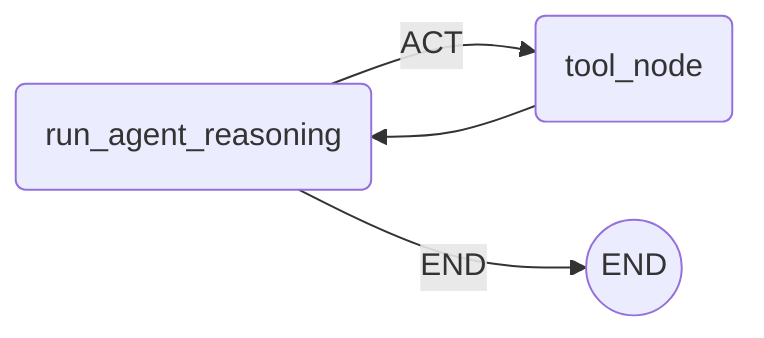

# LangGraph HelloWord

A Python project demonstrating a basic implementation of a state graph with agent reasoning using the LangGraph library.

## Table of Contents
- [Overview](#overview)
- [Usage](#usage)
- [API Documentation](#api-documentation)

## Overview
LangGraph HelloWord is designed to process and respond to messages using a state graph that integrates tool nodes and agent reasoning. The application leverages environmental variables, agent-based message handling, and a graph-based architecture to determine the flow of messages and tool invocations.

## Usage
To run LangGraph HelloWord locally, ensure you have Poetry installed and follow these steps from the project root directory:

1. Install dependencies:
   ```bash
   poetry install
   ```
2. Run the project:
   ```bash
   poetry run python main.py
   ```

## API Documentation
### Main Functions
#### `run_agent_reasoning`
- Description: Executes the agent reasoning process based on input messages.
- Example:
  ```python
  from nodes import run_agent_reasoning
  from langgraph.graph import MessagesState

  state = MessagesState()
  updated_state = run_agent_reasoning(state)
  ```
#### `tool_node`
- Description: Represents a tool node that can execute tools configured in the `react.py`.
- Example:
  ```python
  from nodes import tool_node

  # Assuming tool_node is already configured to be used within a graph
  result = tool_node.invoke(state)
  ```

### Utilities
#### `triple`
- Description: Triples the input number.
- Type: Function
- Parameters:
  - num (float): The number to triple.
- Returns:
  - float: The tripled number.
- Example:
  ```python
  from react import triple

  result = triple(3.5)
  print(f"Tripled value: {result}")
  ```

### Graph Visualization
Below is the generated graph visualization using Mermaid syntax:



<!-- Last updated: 7cd5e317603c5406c190b144bd4d1b4b96cd275f -->