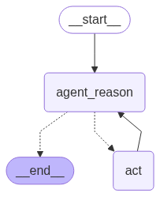

# LangGraph Hello World

This is a Python project utilizing the LangChain library to create a state graph for processing messages with agent reasoning and tool integration.

## Table of Contents
- [Overview](#overview)
- [Getting Started](#getting-started)
- [Usage](#usage)
- [Project Structure](#project-structure)
- [Project Details](#project-details)
- [When to Use This Project](#when-to-use-this-project)
- [Pros and Cons](#pros-and-cons)
- [Future Improvements](#future-improvements)

## Overview

This project demonstrates the integration of language models and tools using LangChain and LangGraph libraries. It processes messages through a state graph that determines the flow based on conditions and actions.



## Getting Started

To get started with this project, clone the repository and install the required dependencies using Poetry:

```bash
poetry install
```

Ensure you configure the environment variables by copying `hello-world/.env.example` to `.env` and setting the appropriate values.

## Usage

To run the application locally:

```bash
poetry run python main.py
```

This executes the program defined in `main.py` which uses a state graph to process a predefined message and outputs the results.

## Project Structure

The project includes the following key files:

- `main.py`: Entry point of the application which sets up and runs the state graph.
- `nodes.py`: Contains the logic for the nodes used in the state graph.
- `react.py`: Defines tools and language model configurations.

## Project Details

### Key Components

- **State Graph**: Manages the flow of messages based on conditions and node outputs.
- **Agent Reasoning**: Uses a language model to process messages and generate responses.
- **Tool Integration**: Tools are integrated into the language model to perform specific tasks like calculations.

### Flow

1. **Start at Agent Reason Node**: Processes the initial message.
2. **Condition Check**: Determines if there is a tool call in the message.
3. **Tool Action**: If a tool is called, process the tool action.
4. **Loop Back**: After tool processing, loop back to the agent reasoning node.

### Modules

- `langchain_core`: Core functionalities for language model integration.
- `langchain_openai`: Integration with OpenAI's GPT models.
- `langchain_tavily`: Provides search capabilities.
- `langgraph`: Manages the state graph structure.

## When to Use This Project

Use this project to understand how to integrate language models with tools in a message processing workflow using state graphs. It's particularly useful for developers interested in natural language processing applications.

## Pros and Cons

| Pros | Cons |
|------|------|
| Demonstrates complex integration of tools with language models | Limited to predefined tools and flows |
| Extensible architecture for adding more nodes and tools | Requires understanding of state graph concepts |

## Future Improvements

| Improvement | Description |
|-------------|-------------|
| Additional nodes | Expand the state graph to include more diverse types of processing. |
| Enhanced tool integration | Increase the number and variety of tools available for use. |


<!-- Last updated: 0c2c271cef34bbf68b2208e83d89cec4fbdc9213 -->