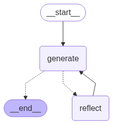

# Reflection Agent

## Overview

Reflection Agent is a Python application designed to enhance Twitter posts by providing critique and generating improved versions of tweets. It's built using the LangChain and LangGraph libraries to model and process the interaction flow.

This project targets developers and social media managers looking to leverage AI to improve social media content.



[Read more about Reflection Agents](https://blog.langchain.com/reflection-agents/)

## Getting Started / Installation

Assuming you've cloned the repository, follow these steps to set up the project:

1. Install dependencies using Poetry:
   ```bash
   poetry install
   ```
2. Copy `.env.example` to `.env` and fill in the necessary API keys:
   ```plaintext
   OPENAI_API_KEY=your_openai_api_key_here
   TAVILY_API_KEY=your_tavily_api_key_here
   LANGCHAIN_API_KEY=your_langchain_api_key_here
   LANGCHAIN_TRACING_V2=true
   LANGCHAIN_ENDPOINT=https://api.smith.langchain.com
   LANGCHAIN_PROJECT=reflection-agent
   ```

## Usage

To run the application, use the following command:

```bash
poetry run python main.py
```

This will start the process where the application listens for input tweets and provides enhancements.

## Project Details

Reflection Agent operates using two main components:

1. **Generation Node**: Enhances tweets based on user requests.
2. **Reflection Node**: Provides critique and suggestions for improving tweets.

The application uses a message-driven architecture where tweets are processed in a cycle between these two nodes until a satisfactory result is achieved or the maximum iteration count is reached.

## When to Use This Project

Use Reflection Agent when you need to automate the enhancement of Twitter posts, either by generating new content or refining existing tweets. It is not suitable for real-time tweet processing due to the iterative nature of feedback and generation.

## Pros and Cons

| Pros                        | Cons                           |
| --------------------------- | ------------------------------ |
| Automates tweet enhancement | Not suitable for real-time use |
| AI-driven precise feedback  | Requires API keys              |

## Future Improvements

| Improvement               | Description                                                                   |
| ------------------------- | ----------------------------------------------------------------------------- |
| Real-time processing mode | Develop a mode for real-time tweet improvements to aid live social media use. |

<!-- Last updated: 0c2c271cef34bbf68b2208e83d89cec4fbdc9213 -->
